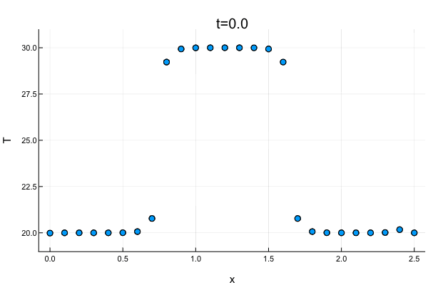

# Diffusion

## CMPT 260 Final Project

### Anshul Singhvi

#### Language - Julia

# Broad goals

Explore heat diffusion

Examine them for stability (or not)

Implement a diffusion animator

# Formulae

∂Ψ/∂t = D⋅∇²Ψ

Ψ = cos(ax)⋅eᵇᵗ

∂Ψ/∂t = D⋅∂²Ψ/∂x² + ℽ (where ℽ is the noise term)

# Method

We solve the one-dimensional case numerically, using a backward-time centered-space 'implicit' method of solving a system.  Currently, both Dirichlet and Neumann methods have been implemented.

An example of the Dirichlet is shown in the following animation, where a system in which the ends have been set to 10 K and the rest of the points are at 0 K is evolved over a timespan of a few seconds.  Due to the high differential in temperature, as well as the constant influx of heat, this happens relatively fast.

Another example of Dirichlet boundary conditions is this, a system in which the boundary temperatures are lower than the interior temperatures, so the system goes into a pseudostable state.

Below is an example of the Neumann boundary condition, with a flux of 0.1 temperature per timestep out of the system.

Below is an example of a mixed boundary condition - the flux on the left is constant, and the temperature on the right is fixed.

The two-dimensional case, in order to save memory, uses an alternating-direction implicit solver.  The problem is solved first for time n+⅟₂ either explicitly or implicitly along the x-axis, and then using the other method along the other axis.  An example of 2D diffusion with this is below: it has a flux of 0.1 K per timestep out of the system on the left, and a stable-temperature state of 20 K on the right.

As for plotting, it is planned to store the plots in the `.hdf5` format to allow for easy replotting.

# Terminology

A *Dirichlet boundary condition* is a boundary condition that forces the temperature on the edges of a system to be a certain value.  

A *Neumann boundary condition* is a boundary condition that forces the flux on the edges of a system to be a certain value, i.e., that there is a constant flow of heat outwards.  

# Julia installation instructions
See [Julia homepage](https://julialang.org/)
